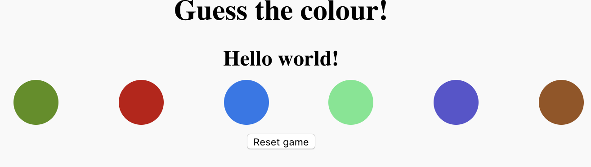

# Guess the Color
In this project you will create an HTML and Javascript game that tests your knowledge of RGB colors. 

## Project Description
Use the `resources` folder to access the step-by-step guides to complete the project.

## Debugging Notes
This project uses the spelling `colour` with a `u`. It is important that every line of code follow the same and correct spelling. 

## Credit
This project is taken from [Raspberry Pi Projects](https://projects.raspberrypi.org/en/projects/cd-beginner-javascript-sushi)
